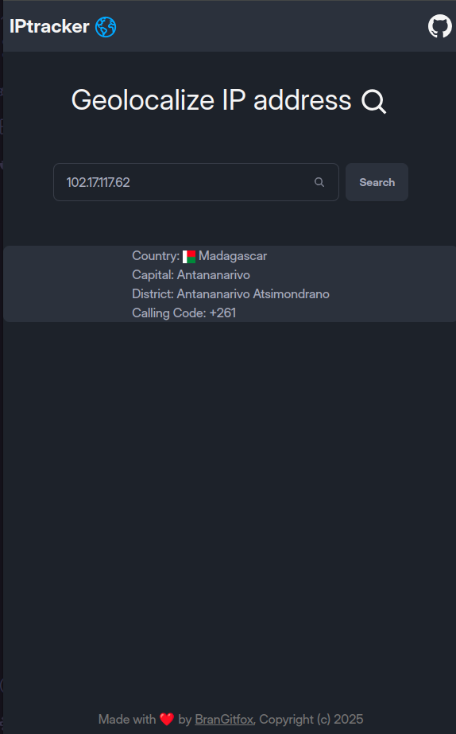

# IP-TRACKER 
IP-Tracker can geolocalize ip-address in world, check the website [here](https://iptracker-brangitfox.netlify.app)
 

# API Reference
```bash
axios.get('https://api.ipgeolocation.io/ipgeo?apiKey=e99753828a36470f8156d603dd7dcebb&ip=the_ip_you_want_to_find}')
```
# Features
<ul>
  <li>Geolocalize IP-Adress</li>
  <li>Show information about country</li>
</ul>

# Contribution
Every contribution is welcome, there is a lot of feature needed like:
<li>Using google map API with data latitude & longitude</li>
<li>show more info about the ip-address</li>
  <li>And more</li>


# Tech i used
  <li>React</li>
  <li>typescript</li>
  <li>Daisy UI</li>
  <li>Tailwind CSS</li>

  Thanks you for attention !


